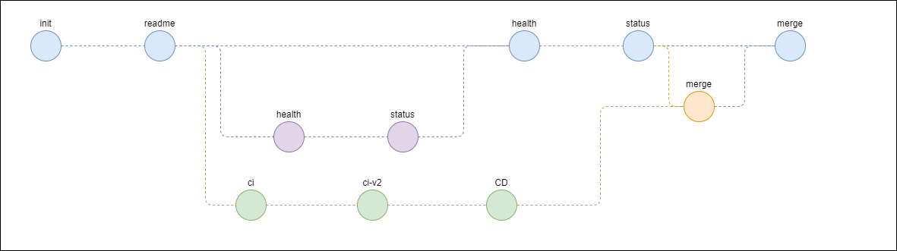

# Git Rebase

This repository is used for teaching others about git rebase. It goes hand in hand with a presentation about the topic and each step in the demo is tagged.

## Merge

### Fast-forward

### Three-way merge

## Rebase

